::: {.objectives}
By the end of this chapter, you should be able to:

- Explain thermodynamic terms such as **process** and **cycle**.
- Define **work** and **heat** in thermodynamics.
- Analyse and apply the **first law of thermodynamics**.
:::

# Process

Whenever properties of a system change, we say that a change in the
thermodynamic state has occurred. The path through which the system passes from
one state to the other is called the **process**.

{width=68%}

## Thermodynamic equilibrium

Thermodynamic equilibrium is a state at which no change occurs within the system
*when it is isolated from the surroundings*. The properties can describe the
state of a system only when it is in thermodynamic equilibrium.

{width=26% fig-align="center"}

Isolate a system and wait: the internal gradients even out, and the system
settles into a state that no longer changes. Full thermodynamic equilibrium
means **all three** of the following hold at once:

$$
\underbrace{\text{thermal equil.}}_{\text{uniform } T}
\;+\;
\underbrace{\text{mechanical equil.}}_{\text{uniform } P}
\;+\;
\underbrace{\text{chemical equil.}}_{\text{no net reaction/diffusion}}
\;=\;
\text{thermodynamic equilibrium}
$$

::: {.note}
The **initial** and **final** states of any process are assumed to be in
**thermodynamic equilibrium**. However, it is NOT necessary that a system
undergoing a process be in equilibrium *during* the process.
:::

::: {.note}
Initial and final states of a process are NOT enough to characterise a process.
:::

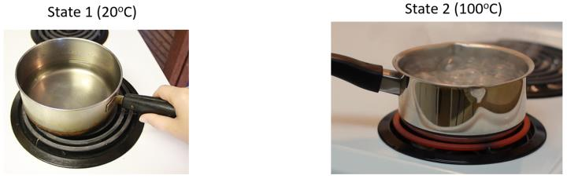{width=62%}

{width=68%}

The two paths start and finish at the same two states, yet the heat and the work
along them are different:
$$
Q_a \neq Q_b, \qquad W_a \neq W_b .
$$

## Energy transfer in a process

Work ($W$) and heat ($Q$) are two different forms of energy transferred between
system and surroundings. Work and heat are NOT system properties. They can only
be identified for a given process.

::: {.note}
Work and heat are called **path functions**, while system properties (e.g.\ $P$,
$T$ and $V$) are **point functions**.
:::

# Work (W)

In mechanics, work is defined as a force $F$ acting through displacement $x$.

$$
\mathrm{d}W = \vec{F} \cdot \mathrm{d}\vec{x}
\qquad \xrightarrow{\ \text{integrate}\ } \qquad
W = \int_{x_1}^{x_2} \vec{F} \cdot \mathrm{d}\vec{x}
$$

Recall that $\vec{a}\cdot\vec{b} = |\vec{a}_{p}|\,|\vec{b}|$, i.e. only the
component of the force **along** the displacement does work.

To evaluate the work, it is necessary to know how the force $F$ varies with the
displacement $x$.

::: {.note}
Work's SI unit is the newton metre (N m), also called the **joule** (J). The rate
of doing work $\dot{W}$ is called **power**. In the SI system, power has units of
joule per second (J/s), or **watt** (W).
:::

## Sign convention

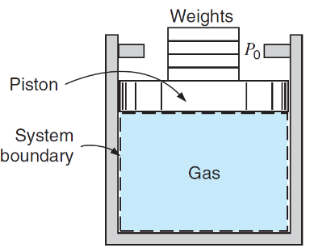{width=34% fig-align="center"}

| | |
|:--|:--|
| Work done **ON** the system BY the surroundings | **compression**, $W > 0$ |
| Work done **BY** the system ON the surroundings | **expansion**, $W < 0$ |

## Expansion / compression work: mathematical relationship

Imagine the external force $F_\text{ext}$ compresses the gas within the cylinder.
The work done by the surroundings on the system is given by:

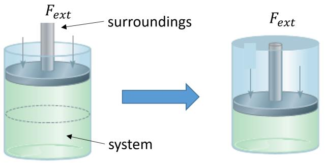{width=58% fig-align="center"}

::: {.gap height="16mm" hint="Work from force and distance, and pressure from force and area, give (I)."}
$$
\mathrm{d}W = F_\text{ext}\,\mathrm{d}l,
\qquad
P_\text{ext} = \frac{F_\text{ext}}{A}
\qquad \Rightarrow \qquad
\mathrm{d}W = P_\text{ext}\,A\,\mathrm{d}l \tag{I}
$$
:::

::: {.gap height="16mm" hint="Geometry: the piston moves INTO the gas, so $\mathrm{d}V = -A\,\mathrm{d}l$ (II)."}
The piston moves **into** the gas, so the volume change and the displacement have
opposite signs:
$$
\mathrm{d}V = -A\,\mathrm{d}l \tag{II}
$$
:::

::: {.gap height="12mm" hint="Combine (I) and (II)."}
Combining (I) and (II):
$$
\mathrm{d}W = -P_\text{ext}\,\mathrm{d}V
$$
:::

Integrating gives the expansion/compression work:

::: {.key}
$$
W = \int -P_\text{ext}\,\mathrm{d}V
$$ {#eq-work}
:::

::: {.note}
In the above equation, as expected, work is positive for compression
($\mathrm{d}V < 0$) and negative for expansion ($\mathrm{d}V > 0$).
:::

::: {.warning}
It is very important to note that some textbooks define work as
$W = \int P_\text{ext}\,\mathrm{d}V$, so that it is **positive for expansion**
(i.e. when the work is done *by* the system), for historical reasons.
:::

::: {.note}
In both expansion and compression processes, work is determined by the
**external** pressure $P_\text{ext}$, which can be different from the system
pressure $P$.
:::

## Work as an area under PV curves

From mathematics, we know that $\int f(x)\,\mathrm{d}x$ is equal to the area
under $f(x)$. Therefore, the area under the path shown in the pressure–volume
(PV) diagram is equal to the amount of work.

{width=62%}

$$
W = -\int P_\text{ext}\,\mathrm{d}V
\qquad \Longrightarrow \qquad
|W| = \left| \int P_\text{ext}\,\mathrm{d}V \right|
    = \text{area under the path in the } P_\text{ext}\text{–}V \text{ diagram}
$$

::: {.example}
As mentioned earlier, a system can change from one state to another in many
different ways. Compare the **work magnitude** required to compress the system
from **i** to **f** for these three cases.

{width=100%}

*Hint: all three paths start at **i** and end at **f**. What does $|W|$
correspond to on each diagram?*

::: {.gap height="17mm" hint="Compare the three shaded areas by eye --- no arithmetic needed."}
$$
|W_a| > |W_c| > |W_b|
$$

The end states are identical in all three cases; only the path differs. This is
exactly why work is a **path function**.
:::
:::

::: {.example}
The external pressure on the piston is estimated to be 1 bar. A burner heats the
system until the volume of the gas increases from $0.05~\mathrm{m^3}$ to
$0.1~\mathrm{m^3}$. Calculate the amount of work done by the system on the
surroundings during this process.

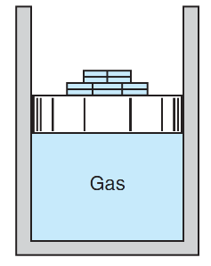{width=22% fig-align="right"}

{width=58%}

**Step 1.** *$P_\text{ext}$ does not change during the process. What does that
let you do with the integral in @eq-work?*

::: {.gap height="16mm" hint="$P_\text{ext}$ is constant, so it comes out of the integral."}
Because $P_\text{ext}$ is constant it comes straight out of the integral:
$$
W = -\int_{1}^{2} P_\text{ext}\,\mathrm{d}V
  = -P_\text{ext}\left(V_2 - V_1\right)
$$
:::

**Step 2.** *Substitute in SI units ($1~\text{bar} = 10^{5}$ Pa). Is this an
expansion or a compression, and so what sign should $W$ have?*

::: {.gap height="20mm" hint="Numbers in; expansion, so $W < 0$."}
$$
W = -10^{5}~\mathrm{Pa} \times \left(0.1 - 0.05\right)\mathrm{m^3}
  = -5 \times 10^{3}~\mathrm{J} = \boxed{-5~\mathrm{kJ}}
$$

The gas expands, so the work is done **by** the system: $W < 0$.
:::
:::

::: {.example}
A gas contained within a
piston–cylinder assembly undergoes three processes in series:

- **Process 1–2:** constant volume from $P_1 = 1$ bar, $V_1 = 4~\mathrm{m^3}$ to
  state 2, where $P_2 = 2$ bar.
- **Process 2–3:** compression to $V_3 = 2~\mathrm{m^3}$, during which the
  pressure–volume relationship is $PV = \text{constant}$.
- **Process 3–4:** constant pressure to state 4, where $V_4 = 1~\mathrm{m^3}$.

Sketch the processes in series on a PV diagram and evaluate the total work for
all of the processes, in kJ. *Note: all pressure values mentioned in the question
refer to the external pressure (i.e. pressure at the system boundaries).*

**(a)** 631 &nbsp;&nbsp; **(b)** 1265 &nbsp;&nbsp; **(c)** 875 &nbsp;&nbsp; **(d)** 954

**Step 1.** *Sketch the three processes on a $P$–$V$ diagram. Which ones move the boundary?*

::: {.gap height="45mm" hint="Sketch: vertical line up at $V = 4$, $PV = C$ curve to $V = 2$, horizontal line to $V = 1$."}
{width=52%}
:::

**Step 2.** *Find the missing pressure $P_3$ first, using the relationship for
process 2–3.*

::: {.gap height="12mm" hint="$P_2V_2 = P_3V_3$ gives $P_3 = 4$ bar."}
$P_2V_2 = P_3V_3$, so
$P_3 = P_2\left(V_2/V_3\right) = 2 \times \tfrac{4}{2} = 4$ bar.
:::

**Step 3.** *Process 1–2: does the boundary move?*

::: {.gap height="10mm" hint="Constant volume, piston does not move, $W_{12} = 0$."}
$V$ is constant, the piston does not move, so
$$W_{12} = 0$$
:::

**Step 4.** *Process 2–3: write $P_\text{ext} = C/V$ and integrate @eq-work.*

::: {.gap height="30mm" hint="$W_{23} = C\ln(V_2/V_3) = P_2V_2\ln(V_2/V_3) = 554.5$ kJ."}
$P_\text{ext}V = C$:
$$
W_{23} = -\int_{V_2}^{V_3} P_\text{ext}\,\mathrm{d}V
       = -\int_{V_2}^{V_3} \frac{C}{V}\,\mathrm{d}V
       = C \ln\!\frac{V_2}{V_3} = P_2 V_2 \ln\!\frac{V_2}{V_3}
$$
$$
W_{23} = \left(2\times10^{5}~\mathrm{Pa} \times 4~\mathrm{m^3}\right)
         \ln\!\left(\frac{4}{2}\right) = 554.5~\mathrm{kJ}
$$
:::

**Step 5.** *Process 3–4: constant pressure. Is it an expansion or a
compression?*

::: {.gap height="14mm" hint="$W_{34} = -P_3(V_4 - V_3) = 400$ kJ, compression so positive."}
$$
W_{34} = -P_3 (V_4 - V_3)
       = -4\times10^{5}\left(1 - 2\right) = 400~\mathrm{kJ}
$$
:::

**Step 6.** *Add the three contributions.*

::: {.gap height="10mm" hint="$0 + 554.5 + 400 = 954$ kJ, answer (d)."}
$$
W_\text{total} = 0 + 554.5 + 400 = \boxed{954~\mathrm{kJ}} \quad \text{(d)}
$$
:::
:::

## Other types of work

**Shaft work:**

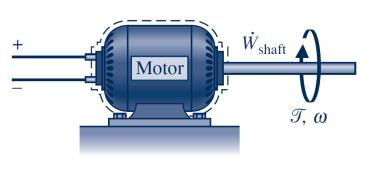{width=32% fig-align="center"}

$$
\dot{W}_\text{shaft} = \text{torque} \times \text{rotational speed}
$$

**Electrical work:**

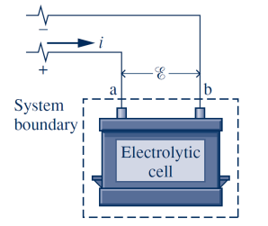{width=26% fig-align="center"}

$$
\dot{W}_\text{electrical} = \text{voltage} \times \text{current}
$$

::: {.note}
$\int -P_\text{ext}\,\mathrm{d}V$ only identifies the
**expansion/compression work**. If other types of work (e.g. shaft work) are
present, we have to use different methods to calculate the work. For instance,
this becomes important in CH4, in which shaft work is regarded as the common type
of work in open systems.
:::

# Heat (Q)

Heat ($Q$) is defined as the form of energy that is transferred across the
boundary of a system **by virtue of the temperature difference** between the
system and the surroundings.

**Heat transfer direction:** heat is transferred from where the temperature is
higher to where the temperature is lower. What temperature is to heat, voltage is
to electrical current.

::: {layout-ncol=2}
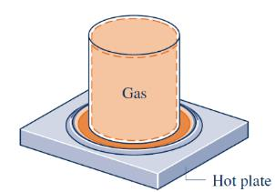

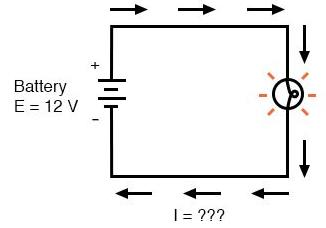
:::

**Sign convention:** heat flowing from the surroundings into the system is taken
as ***positive***. Heat flowing from the system into the surroundings is
negative.

**Unit:** given that heat is a form of energy, it has the SI unit of joule (J).
The rate of heat transfer $\dot{Q}$ has units of joule per second (J/s), or watt
(W), in the SI system.

::: {.note}
Like work, heat appears only at system boundaries and is not a system property.
Any internal energy transfer *within* the system is not treated as heat transfer
in engineering thermodynamics.

{width=88% fig-align="center"}

Draw the boundary around the **whole** box and nothing crosses it: $Q = 0$.
Draw it around the cold part only and heat does cross it: $Q \neq 0$.
The physics has not changed — the bookkeeping has.
:::

# Cycle

A **thermodynamic cycle** is a sequence of processes that begins and ends at the
same state. At the conclusion of a cycle, all properties have the same values
they had at the beginning.

The repeating nature of cycles allows for continuous operation, making them an
important concept in thermodynamics.

## Net amount of work in a cycle

The magnitude of the net work for any cycle is equal to the area enclosed by the
cycle in the PV diagram.

{width=62%}

::: {.gap height="12mm" hint="Split the cycle into its two processes."}
$$
W_\text{cycle} = W_{12} + W_{21}
$$
:::

::: {.gap height="16mm" hint="One process is an expansion, the other a compression: opposite signs, so the two areas partly cancel."}
One process is an expansion and the other a compression, so $W_{12}$ and
$W_{21}$ have opposite signs and their areas partly cancel:
$$
\left|W_\text{cycle}\right| = \left|W_{12}\right| - \left|W_{21}\right|
$$
:::

::: {.key}
$$
\left|W_\text{cycle}\right| = \text{area enclosed by the cycle in the } P\text{–}V \text{ diagram}
$$
:::

::: {.note}
Note that the direction of the **topmost** path determines the sign of the net
work. If the topmost path represents a compression process, the net work is
positive, and vice versa.
:::

::: {.example}
Find the magnitude and sign of the net work delivered by the cycle shown below.
The system mass is 10 kg.

{width=52%}

**Step 1.** *The magnitude of the net work is the area enclosed by the cycle.
Look carefully at what the horizontal axis shows.*

::: {.gap height="22mm" hint="Rectangle: 100 kPa by 1 m³/kg. The axis is SPECIFIC volume, so multiply by the mass."}
The enclosed area is a rectangle of height $\Delta P = 100$ kPa and width
$\Delta v = 1~\mathrm{m^3/kg}$. The horizontal axis is **specific** volume, so
the area must be multiplied by the mass:

$$
\left|W_\text{cycle}\right|
= 100 \times 10^{3}~\mathrm{Pa} \times 1~\frac{\mathrm{m^3}}{\mathrm{kg}}
  \times 10~\mathrm{kg}
= 10^{6}~\mathrm{J} = 1~\mathrm{MJ}
$$
:::

**Step 2.** *Which way does the topmost path run? Use the note above to decide
the sign.*

::: {.gap height="14mm" hint="Topmost path runs left to right (expansion), so $W_\text{cycle} < 0$."}
The topmost path runs left to right, i.e. it is an **expansion**, so the net work
is negative:
$$
\boxed{W_\text{cycle} = -1~\mathrm{MJ}}
$$
:::
:::

# First Law of thermodynamics

::: {.key}
*"If any system undergoes a cyclic process, the sum of the net heat energy input
and the net work input is zero."*
:::

$$
\sum W + \sum Q = 0
\qquad \text{(around a complete cycle)}
$$

The two sums are the total **energy exchanged** between the system and its
surroundings over the whole loop.

**Physical meaning:** the first law of thermodynamics is an expression of the
principle of *conservation of energy*. Energy cannot be created or destroyed. It
can only change from one form to another.

::: {.note}
Thermodynamic laws cannot be proved, but their validity has never been
contradicted.
:::

::: {.example}
80 J of work is done on the system by the paddle. Calculate the required heat
transfer for the system to return to its initial state.

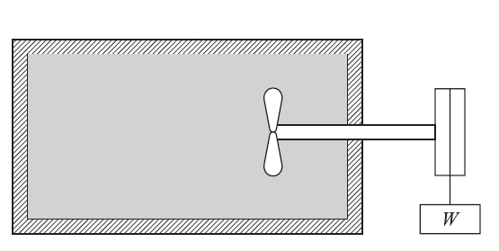{width=34% fig-align="right"}

*Hint: the system returns to its initial state. What kind of process is
that, and which form of the First Law applies? Mind the sign of work done* on
*the system.*

::: {.gap height="23mm" hint="Return to the initial state = a cycle. So $\sum W + \sum Q = 0$ with $\sum W = +80$ J."}
Returning to the initial state makes this a **cycle**, so
$$
\sum W + \sum Q = 0
\qquad \Rightarrow \qquad
(+80~\mathrm{J}) + \sum Q = 0
\qquad \Rightarrow \qquad
\boxed{\sum Q = -80~\mathrm{J}}
$$
:::
:::

# First Law of thermodynamics for a process (non-cyclic)

Using the First Law for a cycle, one can prove that for a non-cyclic process of a
closed system (see the textbook for the proof), the sum of the net heat and work
is equal to the change of a system property, called **internal energy (U)**.

::: {.key}
$$
\underbrace{W + Q}_{\text{energy transfer}}
\;=\;
\underbrace{U_2 - U_1}_{\text{energy change}}
$$
:::

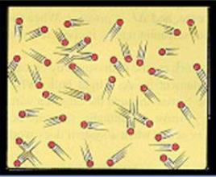{width=22% fig-align="center"}

**Internal energy (U)** is the energy stored by particles of a substance, and its
SI unit is joule (J), similar to work and heat. However, *unlike* work and heat,
internal energy is a **system property**.

::: {.note}
The internal energy, being a system property, can be found as a function of other
properties: $U = f(T, P)$.
:::

::: {.note}
Taking a system over different paths results in the **same** change in internal
energy but **different** amounts of $Q$ and $W$.

$$
W_a + Q_a = U_2 - U_1
\qquad\text{and}\qquad
W_b + Q_b = U_2 - U_1
$$
$$
\text{with } \; W_a \neq W_b \; \text{ and } \; Q_a \neq Q_b .
$$
:::

::: {.note}
**Question:** what is the reference state for the internal energy?

**Answer:** in all engineering applications of thermodynamics, only *changes* in
energy are of interest, and consequently what state is chosen as the reference is
unimportant.
:::

::: {.note}
The internal energy $U$ is an **extensive** property. Its associated intensive
property is the *specific internal energy* $u$, equal to $U$ divided by mass.
Therefore, the First Law can be written as

$$
\underbrace{W + Q = U_2 - U_1}_{[\mathrm{J}]}
\qquad \xrightarrow{\ \div\, m\ } \qquad
\underbrace{w + q = u_2 - u_1}_{[\mathrm{J/kg}]}
$$
:::

::: {.example}
When a system is taken from state "a" to state "b" along "acb", 80 kJ of heat is
supplied into the system and the system does 30 kJ of work.

{width=50% fig-align="right"}

1. How much is the heat transfer along path "adb" if the work done by the system
   is 10 kJ?
2. The system is returned from state "b" to state "a" along the curved path.
   20 kJ of work is done on the system during this process. Determine the heat
   transfer.

**Part 1.**

**Step 1.** *Write down the heat and the work along* acb *with their signs.*

::: {.gap height="10mm" hint="Signs first. Work done BY the system is negative; heat supplied TO it is positive."}
Work done *by* the system is negative in our sign convention, so
$W_{acb} = -30$ kJ and $Q_{acb} = +80$ kJ.
:::

**Step 2.** *Apply the First Law along* acb. *Which quantity can you now find?*

::: {.gap height="14mm" hint="First law along $acb$ gives the property change $U_b - U_a$."}
$$
Q_{acb} + W_{acb} = U_b - U_a
\quad\Rightarrow\quad
80 - 30 = U_b - U_a = 50~\mathrm{kJ}
$$
:::

**Step 3.** *Is $U_b - U_a$ a path function or a property change? Use that
along* adb.

::: {.gap height="20mm" hint="$U_b - U_a$ is a PROPERTY change, so it is the same along $adb$. Reuse it."}
$U_b - U_a$ is a **property** change, so it is the same along *adb*:
$$
Q_{adb} + W_{adb} = U_b - U_a
\quad\Rightarrow\quad
Q_{adb} + (-10) = 50
\quad\Rightarrow\quad
\boxed{Q_{adb} = 60~\mathrm{kJ}}
$$
:::

**Part 2.**

**Step 4.** *Apply the First Law to the process $b \to a$. How is $U_a - U_b$
related to what you found in Part 1?*

::: {.gap height="18mm" hint="Route I, non-cyclic form $b \to a$. Work done ON the system is positive; $U_a - U_b = -50$ kJ."}
**Route I (non-cyclic form).** Work done *on* the system is positive, so
$W_{ba} = +20$ kJ, and $U_a - U_b = -50$ kJ:
$$
Q_{ba} + W_{ba} = U_a - U_b
\quad\Rightarrow\quad
Q_{ba} + 20 = -50
\quad\Rightarrow\quad
\boxed{Q_{ba} = -70~\mathrm{kJ}}
$$
:::

**Step 5 (check).** *$a \to c \to b \to a$ is a cycle. Does the cyclic form of
the First Law give the same $Q_{ba}$?*

::: {.gap height="16mm" hint="Route II, cyclic form round $acb + ba$: $\sum W + \sum Q = 0$. Must agree with route I."}
**Route II (cyclic form).** The path $a \to c \to b \to a$ is a complete
cycle, so $\sum W + \sum Q = 0$:
$$
\underbrace{80}_{Q_{acb}} + \underbrace{(-30)}_{W_{acb}}
+ Q_{ba} + \underbrace{20}_{W_{ba}} = 0
\quad\Rightarrow\quad
Q_{ba} = -70~\mathrm{kJ} \;\; \checkmark
$$
:::
:::

::: {.example}
The following table gives data, in
kJ, for a system undergoing a thermodynamic cycle consisting of four processes in
series. For the cycle, kinetic and potential energy effects can be neglected.
Determine values of $Q_{12}$, $Q_{23}$ and $W_{34}$, respectively, each in kJ.

| Process | $\Delta U$ | $Q$ | $W$ |
|:--|--:|--:|--:|
| 1–2 | 600 | | $-600$ |
| 2–3 | | | $-1300$ |
| 3–4 | $-700$ | 0 | |
| 4–1 | | 500 | 700 |

**(a)** 1200, 200, $-700$ &nbsp;&nbsp; **(b)** 1200, 300, $-700$ &nbsp;&nbsp;
**(c)** 1000, 300, $-500$ &nbsp;&nbsp; **(d)** 700, 200, $-500$

**Step 1.** *Process 1–2: two of the three quantities are in the table.*

::: {.gap height="12mm" hint="$Q_{12} - 600 = 600$, so $Q_{12} = 1200$ kJ."}
$$
Q_{12} + W_{12} = \Delta U_{12}
\quad\Rightarrow\quad
Q_{12} - 600 = 600
\quad\Rightarrow\quad
\boxed{Q_{12} = 1200~\mathrm{kJ}}
$$
:::

**Step 2.** *To find $Q_{23}$ you first need $\Delta U_{23}$. What is $\Delta U$
for the whole cycle? The 4–1 row gives you $\Delta U_{41}$.*

::: {.gap height="26mm" hint="$\Delta U_\text{cycle} = 0$; $\Delta U_{41} = 1200$ kJ, so $\Delta U_{23} = -1100$ kJ."}
For the whole **cycle**, $\Delta U = 0$, because the initial and final states of
the cycle are the same. From the 4–1 row, $\Delta U_{41} = 500 + 700 = 1200$ kJ,
so
$$
\Delta U_{12} + \Delta U_{23} + \Delta U_{34} + \Delta U_{41} = 0
$$
$$
600 + \Delta U_{23} - 700 + 1200 = 0
\quad\Rightarrow\quad
\Delta U_{23} = -1100~\mathrm{kJ}
$$
:::

**Step 3.** *Now apply the First Law to process 2–3.*

::: {.gap height="12mm" hint="$Q_{23} - 1300 = -1100$, so $Q_{23} = 200$ kJ."}
$$
Q_{23} + W_{23} = \Delta U_{23}
\quad\Rightarrow\quad
Q_{23} - 1300 = -1100
\quad\Rightarrow\quad
\boxed{Q_{23} = 200~\mathrm{kJ}}
$$
:::

**Step 4.** *Process 3–4: $Q_{34} = 0$.*

::: {.gap height="14mm" hint="$W_{34} = \Delta U_{34} = -700$ kJ. Answer (a)."}
$$
\underbrace{Q_{34}}_{=\,0} + W_{34} = \Delta U_{34}
\quad\Rightarrow\quad
\boxed{W_{34} = -700~\mathrm{kJ}}
$$

So the answer is (a): 1200, 200, $-700.$
:::
:::

## Generic form of the First Law

In general, a system can possess energy in the form of **internal energy** $U$
inherent in its internal structure, **kinetic energy** $KE$ in its motion, and
**potential energy** $PE$ associated with external forces acting on the mass. We
can therefore write the total energy $E$ as

$$
E = \text{Internal} + \text{Kinetic} + \text{Potential}
  = U + \underbrace{\tfrac{1}{2} m C^{2}}_{KE} + \underbrace{m g z}_{PE}
$$

Therefore, if in addition to the internal energy a process causes a change of
mechanical energy (kinetic and/or potential), the First Law becomes:

$$
Q + W = \Delta E = \left(U_2 - U_1\right)
      + \tfrac{1}{2} m \left(C_2^{2} - C_1^{2}\right)
      + m g \left(z_2 - z_1\right)
$$

or, if we divide both sides by the system mass, we obtain:

::: {.key}
$$
q + w = \Delta e = \left(u_2 - u_1\right)
      + \tfrac{1}{2}\left(C_2^{2} - C_1^{2}\right)
      + g\left(z_2 - z_1\right)
$$ {#eq-firstlaw}
:::

# Importance of system selection

The first and important step to solve any thermodynamic problem must be to define
the system and its boundaries.

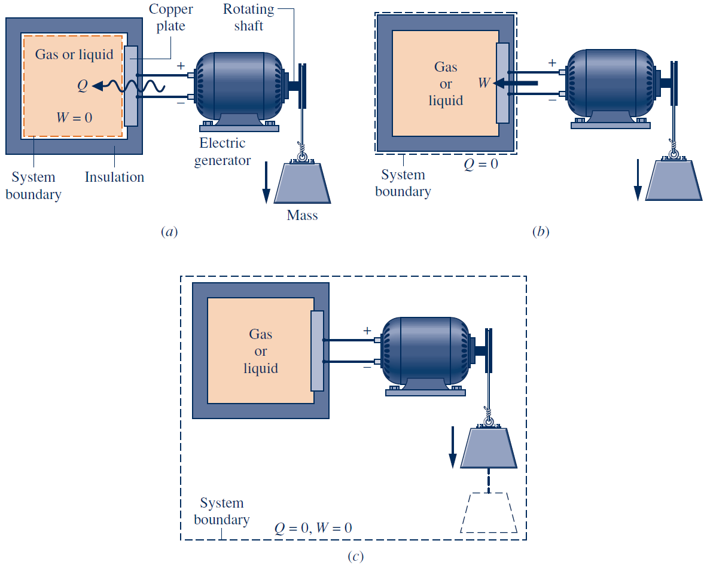{width=78% fig-align="center"}

Exactly the same physical situation, three different boundaries:

| Boundary drawn around | Result |
|:--|:--|
| (a) the gas or liquid only | $Q \neq 0$, $W = 0$ |
| (b) the gas plus the copper plate | $Q = 0$, $W \neq 0$ |
| (c) everything, including the falling mass | $Q = 0$, $W = 0$ |

Choosing the boundary badly does not make a problem wrong — it makes it hard.

# Explore it yourself {#sec-explore}

Work is the area under the path in the $P_\text{ext}$–$V$ diagram, which is why
two processes between the same two states can need very different amounts of
work.

::: {.content-visible when-format="html"}
Switch between the three paths, drag the polytropic exponent, and watch the
shaded area change.

```{=html}
<iframe src="widgets/pv-explorer.html" class="widget-frame"
        title="Interactive PV work explorer" loading="lazy"></iframe>
```
:::

::: {.content-visible when-format="pdf"}
{width=82%}

The interactive version of this figure is on the course website —
follow the *Explore it yourself* link in CH2.
:::



# End-of-chapter problems {#sec-problems}

::: {.tryfirst}
Have a real go at every problem here before you look at a solution. Worked
solutions are released after the lectures, but reading a solution is not the
same as being able to produce one: the time you spend stuck on a problem is
where most of the learning happens. Only once you have an answer of your own,
or have tried every approach you can think of, check it against the solution,
and compare the method, not just the final number.
:::

**P1 [easy].** Air contained within a piston–cylinder assembly is slowly
compressed. As shown in the figure, during this process the pressure at the
system boundaries (i.e. external pressure) first varies linearly with volume and
then remains constant. Determine the total work, in kJ.

{width=58%}

**(a)** 4.35 &nbsp;&nbsp; **(b)** 7.875 &nbsp;&nbsp; **(c)** 0.75 &nbsp;&nbsp; **(d)** 9.465

::: {.gap height="fill"}
::: {.worked}
The area under the path in the $P_\text{ext}$–$V$ diagram gives the magnitude of
the work.

{width=58%}

Process 1–2 is a trapezium:
$$
|W_{12}| = \left(\frac{150 + 100}{2}~\mathrm{kPa}\right) \times 0.015~\mathrm{m^3}
         = 1.875~\mathrm{kJ}
$$

Process 2–3 is a rectangle:
$$
|W_{23}| = 150~\mathrm{kPa} \times 0.04~\mathrm{m^3} = 6~\mathrm{kJ}
$$

Both processes are compressions, so $W_{12} > 0$ and $W_{23} > 0$:
$$
W_\text{total} = 1.875 + 6 = \boxed{7.875~\mathrm{kJ}} \quad \text{(b)}
$$
:::
:::

**P2 [easy].** As shown in the figure, 5 kg of steam contained within a
piston–cylinder assembly undergoes an expansion from state 1, where the specific
internal energy is $u_1 = 2709.9$ kJ/kg, to state 2, where
$u_2 = 2659.6$ kJ/kg. During the process, there is heat transfer to the steam
with a magnitude of 80 kJ. Also, a paddle wheel transfers energy to the steam by
work in the amount of 18.5 kJ. There is no significant change in the kinetic or
potential energy of the steam. Determine the energy transfer by work from the
steam to the piston during the process, in kJ.

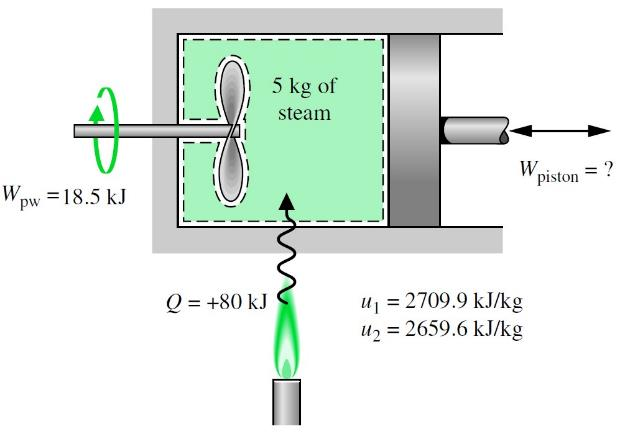{width=58%}

**(a)** 150 &nbsp;&nbsp; **(b)** 350 &nbsp;&nbsp; **(c)** $-350$ &nbsp;&nbsp; **(d)** $-150$

::: {.gap height="fill"}
::: {.worked}
From the First Law,
$$
\sum Q + \sum W = \Delta U = m\,\Delta u
= 5\left(2659.6 - 2709.9\right) = -251.5~\mathrm{kJ}
$$

The heat in and the paddle work in are both positive:
$$
\underbrace{80}_{Q} + \underbrace{18.5}_{W_\text{paddle}} + W_\text{piston}
= -251.5
\quad\Rightarrow\quad
\boxed{W_\text{piston} = -350~\mathrm{kJ}} \quad \text{(c)}
$$

$W < 0$: expansion, work done **by** the system.
:::
:::

**P3 [easy].** A closed system of mass 5 kg undergoes a process in which there is
work of magnitude 9 kJ to the system from the surroundings. The elevation of the
system increases by 700 m during the process. The specific internal energy of the
system decreases by 6 kJ/kg and there is no change in kinetic energy of the
system. The acceleration of gravity is constant at $g = 9.6~\mathrm{m/s^2}$.
Determine the heat transfer, in kJ.

**(a)** 1.5 &nbsp;&nbsp; **(b)** $-3.8$ &nbsp;&nbsp; **(c)** 2.6 &nbsp;&nbsp; **(d)** $-5.4$

::: {.gap height="fill"}
::: {.worked}
Using the generic form of the First Law, per unit mass:
$$
q + w = \left(u_2 - u_1\right)
      + \tfrac{1}{2}\left(C_2^{2} - C_1^{2}\right)
      + g\left(z_2 - z_1\right)
$$
$$
q + \frac{9\times10^{3}~\mathrm{J}}{5~\mathrm{kg}}
  = -6\times10^{3}~\frac{\mathrm{J}}{\mathrm{kg}}
    + 9.6~\frac{\mathrm{m}}{\mathrm{s^2}} \times 700~\mathrm{m}
$$
$$
q = -1080~\mathrm{J/kg}
\quad\Rightarrow\quad
Q = m q = 5 \times (-1080) = \boxed{-5.4~\mathrm{kJ}} \quad \text{(d)}
$$
:::
:::

**P4 [easy].** A closed system of mass 20 kg undergoes a process in which there
is a heat transfer of 1000 kJ from the system to the surroundings. The work done
on the system is 200 kJ. If the initial specific internal energy of the system is
300 kJ/kg, what is the final specific internal energy, in kJ/kg? Neglect changes
in kinetic and potential energy.

**(a)** 150 &nbsp;&nbsp; **(b)** 260 &nbsp;&nbsp; **(c)** 330 &nbsp;&nbsp; **(d)** 420

::: {.gap height="fill"}
::: {.worked}
$$
Q + W = \Delta U
\quad\Rightarrow\quad
-1000 + 200 = \Delta U = -800~\mathrm{kJ}
$$
$$
\Delta u = \frac{\Delta U}{m} = \frac{-800}{20} = -40~\mathrm{kJ/kg}
$$
$$
u_2 = u_1 + \Delta u = 300 - 40 = \boxed{260~\mathrm{kJ/kg}} \quad \text{(b)}
$$
:::
:::

**P5 [medium].** A stop is located 20 mm above the piston at the position shown.
The system is heated and the piston begins to rise. If the mass of the piston is
64 kg, what is the work done by the air on the piston until it reaches the stop?
($P_\text{atm} = 100$ kPa, $g = 9.8~\mathrm{m\,s^{-2}}$)

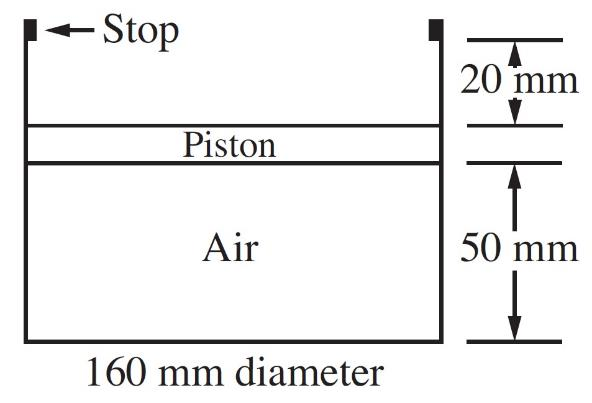{width=52%}

**(a)** $-28$ J &nbsp;&nbsp; **(b)** $-53$ J &nbsp;&nbsp; **(c)** $-41$ J &nbsp;&nbsp; **(d)** $-12$ J

::: {.gap height="fill"}
::: {.worked}
The external pressure on the moving boundary is atmospheric plus the weight of
the piston spread over its face:
$$
P_\text{ext} = P_\text{atm} + \frac{F_\text{piston}}{A}
= 10^{5} + \frac{64 \times 9.8}{\tfrac{\pi}{4}(0.16)^{2}}
= 10^{5} + 3.12\times10^{4} = 131.2~\mathrm{kPa}
$$

$P_\text{ext}$ is constant, so
$$
W = -P_\text{ext}\,\Delta V
  = -131.2\times10^{3} \times \left(0.02 \times \tfrac{\pi}{4}(0.16)^{2}\right)
  = \boxed{-52.7~\mathrm{J}} \quad \text{(b)}
$$

Expansion, so $W < 0$ as expected.
:::
:::

**P6 [medium].** The refrigerant R-410a contained in the cylinder is at 1000 kPa,
50 °C with a volume of 3.32 litres. It is cooled so that the volume is reduced to
half the initial volume. The piston mass and gravitation are such that a pressure
of 400 kPa will float the piston. Find the work in the process.

*(Hint: the gas pressure required to float the piston is equal to the total
external pressure caused by the piston and atmospheric pressure. If it is not
clear why, give me a shout.)*

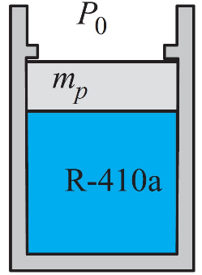{width=22%}

**(a)** 165 J &nbsp;&nbsp; **(b)** 334 J &nbsp;&nbsp; **(c)** 538 J &nbsp;&nbsp; **(d)** 664 J

::: {.gap height="fill"}
::: {.worked}
As soon as the piston starts moving it is no longer in contact with the stops,
and the external pressure becomes equal to the pressure required to float the
piston:
$$
P_\text{ext} = P_\text{float} = 400~\mathrm{kPa}
$$
$$
W = -\int_{V_1}^{V_2} P_\text{ext}\,\mathrm{d}V = -P_\text{float}(V_2 - V_1)
  = -4\times10^{5}\left(0.5 \times 0.00332 - 0.00332\right)
  = \boxed{664~\mathrm{J}} \quad \text{(d)}
$$
:::
:::

**P7 [medium].** A 200 mm diameter piston compresses the air inside a cylinder by
increasing the external pressure from 100 to 800 kPa such that
$P_\text{ext}V^{2} = \text{const}$. If the initial volume $V_1 = 0.1~\mathrm{m^3}$,
the work done on the system is

**(a)** 42.9 kJ &nbsp;&nbsp; **(b)** 24.2 kJ &nbsp;&nbsp; **(c)** 31.6 kJ &nbsp;&nbsp; **(d)** 18.5 kJ

::: {.gap height="fill"}
::: {.worked}
With $P_\text{ext}V^{2} = C$, so $P_\text{ext} = C/V^{2}$:
$$
W = -\int_{V_1}^{V_2} P_\text{ext}\,\mathrm{d}V
  = -\int_{V_1}^{V_2} \frac{C}{V^{2}}\,\mathrm{d}V
  = \frac{C}{V_2} - \frac{C}{V_1} \tag{I}
$$

$V_1$ is known, so we need $C$ and $V_2$:
$$
C = P_{\text{ext},1} V_1^{2} = 10^{5} \times (0.1)^{2}
  = 10^{3}~\mathrm{Pa\,m^{6}} \tag{II}
$$
$$
V_2 = \sqrt{\frac{C}{P_{\text{ext},2}}} = \sqrt{\frac{10^{3}}{8\times10^{5}}}
    = 0.035~\mathrm{m^3} \tag{III}
$$

Substituting (II) and (III) into (I):
$$
W = 10^{3}\left(\frac{1}{0.035} - \frac{1}{0.1}\right)
  \approx 1.85\times10^{4}~\mathrm{J} = \boxed{18.5~\mathrm{kJ}} \quad \text{(d)}
$$

Compression, so $W > 0$ as expected.
:::
:::

**P8 [medium].** Four kilograms of carbon monoxide (CO) is contained in a rigid
tank with a volume of $1~\mathrm{m^3}$. The tank is fitted with a paddle wheel
that transfers energy to the CO at a constant rate of 14 W for 1 h. During the
process, the specific internal energy of the carbon monoxide increases by
10 kJ/kg. If no overall changes in kinetic and potential energy occur, determine
the heat transfer in kJ.

**(a)** $-10.4$ &nbsp;&nbsp; **(b)** 10.4 &nbsp;&nbsp; **(c)** 6.5 &nbsp;&nbsp; **(d)** $-6.5$

::: {.gap height="fill"}
::: {.worked}
First, the work done by the paddle on the system:
$$
W = \dot{W}\,\Delta t = 14~\mathrm{W} \times 3600~\mathrm{s}
  = +50400~\mathrm{J} = 50.4~\mathrm{kJ}
$$

Then the First Law, with the kinetic and potential terms zero:
$$
Q = \Delta U - W = \left(4~\mathrm{kg}\right)\left(10~\mathrm{kJ/kg}\right)
  - 50.4~\mathrm{kJ} = \boxed{-10.4~\mathrm{kJ}} \quad \text{(a)}
$$

Energy is removed from the system through heat transfer.
:::
:::

**P9 [hard].** Warm air is contained in a piston–cylinder assembly oriented
horizontally as shown. The air cools slowly from an initial volume of
$0.003~\mathrm{m^3}$ to a final volume of $0.002~\mathrm{m^3}$. During the
process, the spring exerts a force that varies linearly from an initial value of
900 N to a final value of zero. The atmospheric pressure is 100 kPa, and the area
of the piston face is $0.018~\mathrm{m^2}$. Friction between the piston and the
cylinder wall can be neglected. Determine the amount of work.

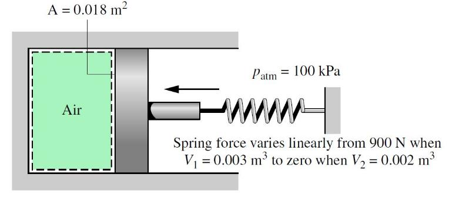{width=62%}

**(a)** 125 J &nbsp;&nbsp; **(b)** 2.5 J &nbsp;&nbsp; **(c)** 20 J &nbsp;&nbsp; **(d)** 10 J

::: {.gap height="fill"}
::: {.worked}
To find the work we first need the external pressure:
$$
P_\text{ext} = P_\text{atm} + P_\text{gauge},
\qquad\text{where}\qquad
P_\text{gauge} = \frac{F_\text{spring}}{A} \tag{$*$}
$$

$F_\text{spring}$ is linear in $V$, passing through
$(V = 0.003,\ F = 900)$ and $(V = 0.002,\ F = 0)$:
$$
F_\text{spring} = 9\times10^{5} V - 1800 \tag{$**$}
$$

Combining ($*$) and ($**$):
$$
P_\text{ext} = 10^{5} + \frac{9\times10^{5}V - 1800}{0.018}
             = 10^{5} + 5\times10^{7}V - 10^{5}
             = 5\times10^{7}V
$$
$$
W = -\int_{V_1}^{V_2} P_\text{ext}\,\mathrm{d}V
  = -\int_{0.003}^{0.002} 5\times10^{7}V\,\mathrm{d}V
  = -25\times10^{6}\left(0.002^{2} - 0.003^{2}\right)
  = \boxed{125~\mathrm{J}} \quad \text{(a)}
$$

Compression, so $W > 0$ as expected.
:::
:::

**P10 [hard].** Gaseous CO$_2$ is contained in a vertical piston–cylinder assembly
by a piston of mass 50 kg and having a face area of $0.01~\mathrm{m^2}$. The mass
of the CO$_2$ is 4 g. The CO$_2$ initially occupies a volume of $0.005~\mathrm{m^3}$
and has a specific internal energy of 657 kJ/kg. The atmosphere exerts a pressure
of 100 kPa on the top of the piston. Heat transfer in the amount of 1.95 kJ
occurs slowly from the CO$_2$ to the surroundings, and the volume of the CO$_2$
decreases to $0.0025~\mathrm{m^3}$. Friction between the piston and the cylinder
wall can be neglected. The local acceleration of gravity is
$9.81~\mathrm{m/s^2}$. Determine the final specific internal energy of CO$_2$, in
kJ/kg.

**(a)** 324 &nbsp;&nbsp; **(b)** 148 &nbsp;&nbsp; **(c)** 263 &nbsp;&nbsp; **(d)** 89

::: {.gap height="fill"}
::: {.worked}
To use the energy equation we first need $W$, which means the external pressure
at the moving boundary:
$$
P_\text{ext} = P_\text{atm} + P_\text{gauge}
= 10^{5} + \frac{50 \times 9.81}{0.01}
= 149\,050~\mathrm{Pa} = 149.1~\mathrm{kPa}
$$

$P_\text{ext}$ is constant, so
$$
W = -P_\text{ext}\left(V_2 - V_1\right)
  = -149.1\times10^{3}\left(0.0025 - 0.005\right) = 373~\mathrm{J}
$$

An energy balance for the CO$_2$, with the kinetic and potential terms zero:
$$
Q + W = \Delta U
\quad\Rightarrow\quad
\Delta U = -1.95 + 0.373 = -1.577~\mathrm{kJ}
$$

Then, with $\Delta U = m\,\Delta u$:
$$
u_2 = \frac{\Delta U}{m} + u_1
    = \frac{-1.577~\mathrm{kJ}}{0.004~\mathrm{kg}} + 657~\mathrm{kJ/kg}
    = \boxed{262.8~\mathrm{kJ/kg}} \quad \text{(c)}
$$
:::
:::
